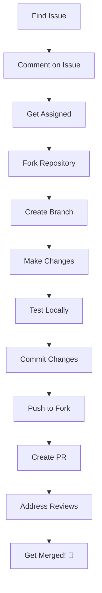

# 🚀 Open Source Contribution Strategy for Harshit Tiwari

A personalized step-by-step guide to contribute to open source projects based on your skills in **Python, JavaScript/React, and FastAPI**.

---

## 📋 Table of Contents

1. [Getting Started](#-getting-started)
2. [Skill-Based Project Recommendations](#-skill-based-project-recommendations)
3. [Weekly Action Plan](#-weekly-action-plan)
4. [Finding Issues](#-finding-issues)
5. [Making Your First Contribution](#-making-your-first-contribution)
6. [Building Your Profile](#-building-your-profile)
7. [Advanced Strategies](#-advanced-strategies)

---

## 🏁 Getting Started

### Week 1-2: Foundation Setup

| Task | Status | Priority |
|------|--------|----------|
| ⭐ Star 20+ repos you find interesting | ⬜ | High |
| 👀 Watch 5 active repos in your tech stack | ⬜ | High |
| 🍴 Fork 3 beginner-friendly projects | ⬜ | High |
| 📖 Read contribution guidelines of 5 projects | ⬜ | Medium |
| 💬 Join Discord/Slack of 2-3 projects | ⬜ | Medium |

---

## 🎯 Skill-Based Project Recommendations

### 🐍 Python Projects

| Project | Difficulty | Type of Contributions |
|---------|------------|----------------------|
| [FastAPI](https://github.com/tiangolo/fastapi) | ⭐⭐⭐ | Docs, Examples, Bug Fixes |
| [httpx](https://github.com/encode/httpx) | ⭐⭐ | Docs, Tests, Bug Fixes |
| [Pydantic](https://github.com/pydantic/pydantic) | ⭐⭐⭐ | Docs, Bug Fixes |
| [Rich](https://github.com/Textualize/rich) | ⭐⭐ | Examples, Docs |
| [Typer](https://github.com/tiangolo/typer) | ⭐⭐ | Docs, Examples |
| [Poetry](https://github.com/python-poetry/poetry) | ⭐⭐⭐ | Bug Fixes, Features |
| [Streamlit](https://github.com/streamlit/streamlit) | ⭐⭐ | Components, Docs |

### ⚛️ JavaScript/React Projects

| Project | Difficulty | Type of Contributions |
|---------|------------|----------------------|
| [React](https://github.com/facebook/react) | ⭐⭐⭐⭐ | Docs, Bug Fixes |
| [Next.js](https://github.com/vercel/next.js) | ⭐⭐⭐ | Examples, Docs |
| [Chakra UI](https://github.com/chakra-ui/chakra-ui) | ⭐⭐ | Components, Docs |
| [React Query](https://github.com/TanStack/query) | ⭐⭐⭐ | Docs, Examples |
| [Zustand](https://github.com/pmndrs/zustand) | ⭐⭐ | Docs, Examples |
| [Radix UI](https://github.com/radix-ui/primitives) | ⭐⭐⭐ | Components, A11y |
| [Tailwind CSS](https://github.com/tailwindlabs/tailwindcss) | ⭐⭐ | Docs, Plugins |

### 🔧 Full Stack / DevOps

| Project | Difficulty | Type of Contributions |
|---------|------------|----------------------|
| [Supabase](https://github.com/supabase/supabase) | ⭐⭐⭐ | Docs, Examples |
| [Appwrite](https://github.com/appwrite/appwrite) | ⭐⭐ | Docs, SDKs |
| [Directus](https://github.com/directus/directus) | ⭐⭐⭐ | Extensions, Docs |

---

## 📅 Weekly Action Plan

### 🗓️ Month 1: Foundation

```
Week 1:
├── ⬜ Set up development environment
├── ⬜ Read "How to Contribute to Open Source" guide
├── ⬜ Star & explore 20 repositories
└── ⬜ Make your first documentation fix

Week 2:
├── ⬜ Fix 2 typos/documentation issues
├── ⬜ Comment on 3 issues offering help
├── ⬜ Review 1 open PR (leave constructive feedback)
└── ⬜ Join 2 project communities

Week 3:
├── ⬜ Work on your first "good first issue"
├── ⬜ Write a blog post about your experience
├── ⬜ Share your journey on Twitter/LinkedIn
└── ⬜ Help someone else in community

Week 4:
├── ⬜ Submit your first meaningful PR
├── ⬜ Start on a medium-difficulty issue
├── ⬜ Create an issue for improvement you noticed
└── ⬜ Review your month's progress
```

### 🗓️ Month 2: Growth

```
Week 5-8:
├── ⬜ Aim for 1 merged PR per week
├── ⬜ Take on increasingly complex issues
├── ⬜ Start contributing code (not just docs)
├── ⬜ Build relationships with maintainers
└── ⬜ Mentor newcomers if possible
```

### 🗓️ Month 3+: Impact

```
├── ⬜ Propose new features
├── ⬜ Become a regular contributor to 1-2 projects
├── ⬜ Write tutorials about the projects
├── ⬜ Speak about your contributions
└── ⬜ Consider becoming a maintainer
```

---

## 🔍 Finding Issues

### Search Queries to Use

```bash
# Good First Issues
label:"good first issue" language:python is:open
label:"good first issue" language:javascript is:open

# Help Wanted
label:"help wanted" language:python is:open
label:"help wanted" language:typescript is:open

# Documentation
label:documentation language:python is:open
label:docs is:open

# Your Stack Specific
label:"good first issue" repo:tiangolo/fastapi
label:"good first issue" repo:chakra-ui/chakra-ui
```

### Useful Websites

| Website | Description |
|---------|-------------|
| [Good First Issues](https://goodfirstissues.com) | Curated list of beginner issues |
| [Up For Grabs](https://up-for-grabs.net) | Projects with tasks for new contributors |
| [First Timers Only](https://www.firsttimersonly.com) | Welcoming projects for beginners |
| [CodeTriage](https://www.codetriage.com) | Get issues delivered to your inbox |
| [Contrib.rocks](https://contrib.rocks) | Find projects to contribute |

---

## 🎬 Making Your First Contribution

### Step-by-Step Process



### Example Workflow

```bash
# 1. Fork the repo on GitHub, then clone
git clone https://github.com/Harshit7623/project-name.git
cd project-name

# 2. Add upstream remote
git remote add upstream https://github.com/original/project-name.git

# 3. Create a feature branch
git checkout -b fix/issue-123-bug-description

# 4. Make your changes and test

# 5. Commit with conventional commits
git add .
git commit -m "fix(module): resolve issue #123 - brief description"

# 6. Push to your fork
git push origin fix/issue-123-bug-description

# 7. Create PR on GitHub
```

---

## 📊 Building Your Profile

### Daily Habits

- [ ] 🟢 Commit something every day (even small fixes)
- [ ] 👀 Review at least 1 issue/PR
- [ ] 💬 Engage in discussions
- [ ] 📚 Learn something new

### Weekly Goals

| Goal | Target |
|------|--------|
| PRs Submitted | 2-3 |
| Issues Commented | 5+ |
| Code Reviews | 2+ |
| Blog/Tweet | 1 |

### Profile Optimization Checklist

- [ ] Professional profile photo
- [ ] Compelling bio with keywords
- [ ] Pinned top 6 repositories
- [ ] README.md on profile repo
- [ ] Consistent activity graph
- [ ] Quality over quantity

---

## 🚀 Advanced Strategies

### 1. **Become a Domain Expert**
Focus on 2-3 projects and become a go-to contributor.

### 2. **Write About It**
- Blog about your contributions
- Create tutorials for projects you contribute to
- Share on Dev.to, Hashnode, or Medium

### 3. **Build Relationships**
- Engage genuinely with maintainers
- Attend virtual meetups
- Join project-specific events

### 4. **Create Your Own**
- Build tools that solve problems you faced
- Open source your side projects
- Create starter templates

### 5. **Participate in Events**
| Event | When | Focus |
|-------|------|-------|
| Hacktoberfest | October | General OSS |
| Google Summer of Code | Summer | Major projects |
| MLH Hackathons | Year-round | Quick projects |
| 24 Pull Requests | December | Holiday giving |

---

## 📈 Track Your Progress

### Monthly Review Template

```markdown
## Month: [Month Year]

### 🎯 Goals
- [ ] Goal 1
- [ ] Goal 2

### 📊 Stats
- PRs Merged: X
- Issues Closed: X
- New Repositories Contributed: X

### 🏆 Highlights
- 

### 📝 Lessons Learned
- 

### 🎯 Next Month Goals
- 
```

---

## 🔗 Resources

### Must-Read Guides
- [GitHub's Open Source Guide](https://opensource.guide/)
- [First Contributions Tutorial](https://github.com/firstcontributions/first-contributions)
- [How to Contribute to Open Source](https://github.com/freeCodeCamp/how-to-contribute-to-open-source)

### Tools
- [GitHub CLI](https://cli.github.com/) - Manage PRs from terminal
- [Refined GitHub](https://github.com/refined-github/refined-github) - Browser extension
- [OctoTree](https://www.octotree.io/) - Code navigation

---

<div align="center">

## 💪 You've Got This!

> "The best time to start contributing to open source was yesterday. The second best time is today."

**Remember:** Every expert was once a beginner. Your first PR doesn't need to be perfect—it needs to be submitted!

---

Made with ❤️ for **Harshit Tiwari** | Start your journey today! 🚀

</div>
