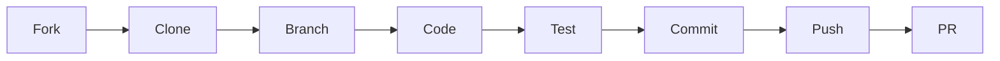

# 🤝 Contributing Guidelines

First off, thank you for considering contributing! 🎉 It's people like you that make this project amazing.

## 📋 Table of Contents

- [Code of Conduct](#-code-of-conduct)
- [How Can I Contribute?](#-how-can-i-contribute)
- [Getting Started](#-getting-started)
- [Development Process](#-development-process)
- [Style Guidelines](#-style-guidelines)
- [Commit Messages](#-commit-messages)
- [Pull Request Process](#-pull-request-process)

---

## 📜 Code of Conduct

This project and everyone participating in it is governed by our Code of Conduct. By participating, you are expected to uphold this code. Please report unacceptable behavior to [harshit31250@gmail.com](mailto:harshit31250@gmail.com).

### Our Pledge

- 🤗 Be welcoming and inclusive
- 🎯 Focus on what is best for the community
- 💬 Use welcoming and inclusive language
- 🙏 Be respectful of differing viewpoints

---

## 💡 How Can I Contribute?

### 🐛 Reporting Bugs

Before creating bug reports, please check existing issues. When you create a bug report, include as many details as possible:

**Bug Report Template:**
```markdown
**Describe the bug**
A clear description of what the bug is.

**To Reproduce**
Steps to reproduce the behavior:
1. Go to '...'
2. Click on '....'
3. See error

**Expected behavior**
What you expected to happen.

**Screenshots**
If applicable, add screenshots.

**Environment:**
 - OS: [e.g., Windows 11]
 - Browser: [e.g., Chrome 120]
 - Version: [e.g., 1.0.0]
```

### 🚀 Suggesting Enhancements

Enhancement suggestions are tracked as GitHub issues. Create an issue and provide:

- **Clear title** describing the enhancement
- **Detailed description** of the proposed functionality
- **Use cases** explaining why this would be useful
- **Possible implementation** if you have ideas

### 📝 Your First Code Contribution

Unsure where to begin? Look for these labels:

| Label | Description |
|-------|-------------|
| `good first issue` | Good for newcomers |
| `help wanted` | Extra attention needed |
| `documentation` | Documentation improvements |
| `bug` | Something isn't working |

---

## 🏁 Getting Started

1. **Fork the Repository**
   ```bash
   # Click the 'Fork' button on GitHub
   ```

2. **Clone Your Fork**
   ```bash
   git clone https://github.com/YOUR-USERNAME/repo-name.git
   cd repo-name
   ```

3. **Add Upstream Remote**
   ```bash
   git remote add upstream https://github.com/Harshit7623/repo-name.git
   ```

4. **Install Dependencies**
   ```bash
   npm install
   # or
   pip install -r requirements.txt
   ```

5. **Create a Branch**
   ```bash
   git checkout -b feature/your-feature-name
   ```

---

## 🔄 Development Process



### Workflow

1. ✅ Sync your fork with upstream
2. ✅ Create a feature branch
3. ✅ Make your changes
4. ✅ Write/update tests
5. ✅ Run tests locally
6. ✅ Commit with clear messages
7. ✅ Push to your fork
8. ✅ Create a Pull Request

---

## 🎨 Style Guidelines

### JavaScript/TypeScript

```javascript
// ✅ Good
const getUserData = async (userId) => {
  const response = await fetch(`/api/users/${userId}`);
  return response.json();
};

// ❌ Bad
async function getuser(id) {
  var r = await fetch('/api/users/' + id)
  return r.json()
}
```

### Python

```python
# ✅ Good
def get_user_data(user_id: str) -> dict:
    """Fetch user data from the API."""
    response = requests.get(f"/api/users/{user_id}")
    return response.json()

# ❌ Bad
def getUserData(id):
    r = requests.get('/api/users/' + id)
    return r.json()
```

### General Guidelines

- 📏 Use consistent indentation (2 or 4 spaces)
- 📝 Write meaningful comments
- 🏷️ Use descriptive variable names
- 🧹 Remove console.log/print statements before PR
- ✨ Follow existing code style

---

## 💬 Commit Messages

We follow [Conventional Commits](https://www.conventionalcommits.org/):

### Format

```
<type>(<scope>): <description>

[optional body]

[optional footer]
```

### Types

| Type | Description |
|------|-------------|
| `feat` | New feature |
| `fix` | Bug fix |
| `docs` | Documentation only |
| `style` | Formatting, missing semicolons, etc. |
| `refactor` | Code change that neither fixes a bug nor adds a feature |
| `test` | Adding missing tests |
| `chore` | Maintenance tasks |

### Examples

```bash
# ✅ Good commits
feat(auth): add Google OAuth login
fix(api): resolve null pointer in user endpoint
docs(readme): update installation instructions
style(components): format according to prettier

# ❌ Bad commits
fixed stuff
updates
WIP
asdfasdf
```

---

## 🔀 Pull Request Process

### Before Submitting

- [ ] Code follows the style guidelines
- [ ] Self-review completed
- [ ] Comments added for complex code
- [ ] Documentation updated
- [ ] No new warnings generated
- [ ] Tests added and passing
- [ ] Branch is up to date with main

### PR Template

```markdown
## Description
Brief description of changes

## Type of Change
- [ ] Bug fix (non-breaking)
- [ ] New feature (non-breaking)
- [ ] Breaking change
- [ ] Documentation update

## Testing
Describe tests performed

## Checklist
- [ ] My code follows the style guidelines
- [ ] I have performed a self-review
- [ ] I have added tests
- [ ] All tests pass
```

### Review Process

1. 👀 At least one maintainer review required
2. ✅ All CI checks must pass
3. 💬 Address all review comments
4. 🔄 Keep PR updated with main branch
5. 🎉 Once approved, maintainer will merge

---

## 🙏 Thank You!

Your contributions make this project better for everyone. We appreciate your time and effort!

---

<div align="center">

**Happy Contributing!** 🚀

Made with ❤️ by [Harshit Tiwari](https://github.com/Harshit7623)

</div>
